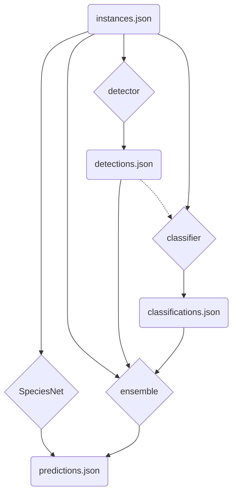

# SpeciesNet

[](https://github.com/google/cameratrapai/actions/workflows/python-build.yml)

An ensemble of AI models and heuristics for classifying wildlife camera trap images

## Table of Contents

- [Overview](#overview)
- [Citation](#citation)
- [Getting Started](#getting-started)
- [Running the Code](#running-the-code)
- [Supported Models](#supported-models)
- [Input Schema](#input-schema)
- [Output Schemas](#output-schemas)
  - [Full Inference](#full-inference)
  - [Classifier-only Inference](#classifier-only-inference)
  - [Detector-only Inference](#detector-only-inference)
- [Ensemble Decision-Making](#ensemble-decision-making)
- [Developing and Contributing Code](#developing-and-contributing-code)

## Overview

This repository hosts code for running an ensemble of two models: (1) an object detector that finds objects of interest in wildlife camera images, and (2) an image classifier that classifies those objects to the species level. This ensemble is used for species recognition in the [Wildlife Insights](https://www.wildlifeinsights.org/) platform.

The species classifier was trained at Google using a large dataset of camera trap images and an [EfficientNet V2 M](https://arxiv.org/abs/2104.00574) architecture. It is designed to classify images into one of more than 2000 labels, covering diverse animal species, higher-level taxa (like "mammalia" or "felidae"), and non-animal classes ("blank", "vehicle"). The object detector, based on the publicly-available [MegaDetector](https://github.com/agentmorris/MegaDetector), identifies the locations and types of objects present in the images, categorizing them as animals, humans, or vehicles.

The SpeciesNet ensemble combines these two models using a set of heuristics and, optionally, geofencing rules and taxonomic aggregation that take into account the geographical origin of the image to improve the reliability of its species classification. This architecture enables the model to be robust to challenging input images, providing improved performance compared to just classifying alone.

The full details of the models and their ensembling are discussed in this research paper:
[To crop or not to crop: Comparing whole-image and cropped classification on a large dataset of camera trap images](https://doi.org/10.1049/cvi2.12318)

## Citation

You can cite this work using BibTeX format:

```text
@article{gadot2024crop,
  title={To crop or not to crop: Comparing whole-image and cropped classification on a large dataset of camera trap images},
  author={Gadot, Tomer and Istrate, Ștefan and Kim, Hyungwon and Morris, Dan and Beery, Sara and Birch, Tanya and Ahumada, Jorge},
  journal={IET Computer Vision},
  year={2024},
  publisher={Wiley Online Library}
}
```

## Getting started

First, to use the code and model weights from this repository, you need to clone it:

```bash
git clone https://github.com/google/cameratrapai
cd cameratrapai
```

## Running the code

We recommend that you create a Python virtual environment as follows:

```bash
python -m venv .env
source .env/bin/activate
```

Depending on how you plan to run SpeciesNet, you can install either:

- minimal requirements

    ```bash
    pip install -e .
    ```

- minimal + notebooks requirements

    ```bash
    pip install -e .[notebooks]
    ```

- minimal + server requirements

    ```bash
    pip install -e .[server]
    ```

- minimal + cloud requirements (`az` / `gs` / `s3`), e.g.

    ```bash
    pip install -e .[gs]
    ```

- any combination of the above requirements, e.g.

    ```bash
    pip install -e .[notebooks,server]
    ```

Once you have installed the necessary dependencies, you have several ways of running SpeciesNet:

1. Via a restartable script for one-off jobs, by setting one of the following flags: `--instances_json`, `--filepaths`, `--filepaths_txt`, `--folders`, `--folders_txt`.

    ```bash
    python scripts/run_model.py \
        --instances_json=test_data/instances.json \
        --predictions_json=predictions.json
    ```

1. Via a local prediction server, which you can launch with:

    ```bash
    python scripts/run_server.py
    ```

   ...and query with:

    ```bash
    curl \
        -H "Content-Type: application/json" http://0.0.0.0:8000/predict \
        -d "@test_data/instances.json"
    ```

1. Programmatically via the internal API. See [this notebook](notebooks/run_model.ipynb) for several examples.

## Inference pathways

TODO(agentmorris): Please decide if this diagram is useful when you need to explain how to decouple various components.



## Supported models

- [v4.0.0a](model_cards/v4.0.0a) (default): Always crop model, i.e. we run the detector first and crop the image to the top detection bounding box before feeding it to the species classifier.
- [v4.0.0b](model_cards/v4.0.0b): Full image model, i.e. we run both the detector and the species classifier on the full image, independently.

## Input schema

SpeciesNet runs inference on instances dicts in the following format. When you call the model, you can either prepare your requests to match this format or, in some cases, other supported formats will be converted to this automatically.

```text
{
    "instances": [
        {
            "filepath": str  => Image filepath.
            "country": str (optional)  => 3-letter country code (ISO 3166-1 Alpha-3) for the location where the image was taken.
            "admin1_region": str (optional)  => First-level administrative division (in ISO 3166-2 format) within the country above.
            "latitude": float (optional)  => Latitude where the image was taken.
            "longitude": float (optional)  => Longitude where the image was taken.
        },
        ...  => A request can contain multiple instances in the format above.
    ]
}
```

## Output schemas

When you receive a response from SpeciesNet, it will be in one of the following formats, depending on which elements of the ensemble you ran.

### Full inference

```text
{
    "predictions": [
        {
            "filepath": str  => Image filepath.
            "failures": list[str] (optional)  => List of internal components that failed during prediction (e.g. "CLASSIFIER", "DETECTOR", "GEOLOCATION"). If absent, the prediction was successful.
            "country": str (optional)  => 3-letter country code (ISO 3166-1 Alpha-3) for the location where the image was taken. It can be overwritten if the country from the request doesn't match the country of (latitude, longitude).
            "admin1_region": str (optional)  => First-level administrative division (in ISO 3166-2 format) within the country above. If not provided in the request, it can be computed from (latitude, longitude) when those coordinates are specified. Included in the response only for some countries that are used in geofencing (e.g. "USA").
            "latitude": float (optional)  => Latitude where the image was taken, included only if (latitude, longitude) were present in the request.
            "longitude": float (optional)  => Longitude where the image was taken, included only if (latitude, longitude) were present in the request.
            "classifications": {  => dict (optional)  => Top-5 classifications. Included only if "CLASSIFIER" if not part of the "failures" field.
                "classes": list[str]  => List of top-5 classes predicted by the classifier, matching the decreasing order of their scores below.
                "scores": list[float]  => List of scores corresponding to top-5 classes predicted by the classifier, in decreasing order.
            },
            "detections": [  => list (optional)  => List of detections with confidence scores > 0.01, in decreasing order of their scores. Included only if "DETECTOR" if not part of the "failures" field.
                {
                    "category": str  => Detection class "1" (= animal), "2" (= human) or "3" (= vehicle) from MegaDetector's raw output.
                    "label": str  => Detection class "animal", "human" or "vehicle", matching the "category" field above. Added for readability purposes.
                    "conf": float  => Confidence score of the current detection.
                    "bbox": list[float]  => Bounding box coordinates, in (xmin, ymin, width, height) format, of the current detection. Coordinates are normalized to the [0.0, 1.0] range, relative to the image dimensions.
                },
                ...  => A prediction can contain zero or multiple detections.
            ],
            "prediction": str (optional)  => Final prediction of the SpeciesNet ensemble. Included only if "CLASSIFIER" and "DETECTOR" are not part of the "failures" field.
            "prediction_score": float (optional)  => Final prediction score of the SpeciesNet ensemble. Included only if the "prediction" field above is included.
            "prediction_source": str (optional)  => Internal component that produced the final prediction. Used to collect information about which parts of the SpeciesNet ensemble fired. Included only if the "prediction" field above is included.
            "exif": {  => dict (optional)  => Relevant EXIF fields extracted from the image metadata.
                "DateTimeOriginal": str (optional)  => Date and time when the original image was captured.
            }
            "model_version": str  => A string representing the version of the model that produced the current prediction.
        },
        ...  => A response will contain one prediction for each instance in the request.
    ]
}
```

### Classifier-only inference

```text
{
    "predictions": [
        {
            "filepath": str  => Image filepath.
            "failures": list[str] (optional)  => List of internal components that failed during prediction (in this case, only "CLASSIFIER" can be in that list). If absent, the prediction was successful.
            "classifications": {  => dict (optional)  => Top-5 classifications. Included only if "CLASSIFIER" if not part of the "failures" field.
                "classes": list[str]  => List of top-5 classes predicted by the classifier, matching the decreasing order of their scores below.
                "scores": list[float]  => List of scores corresponding to top-5 classes predicted by the classifier, in decreasing order.
            }
        },
        ...  => A response will contain one prediction for each instance in the request.
    ]
}
```

### Detector-only inference

```text
{
    "predictions": [
        {
            "filepath": str  => Image filepath.
            "failures": list[str] (optional)  => List of internal components that failed during prediction (in this case, only "DETECTOR" can be in that list). If absent, the prediction was successful.
            "detections": [  => list (optional)  => List of detections with confidence scores > 0.01, in decreasing order of their scores. Included only if "DETECTOR" if not part of the "failures" field.
                {
                    "category": str  => Detection class "1" (= animal), "2" (= human) or "3" (= vehicle) from MegaDetector's raw output.
                    "label": str  => Detection class "animal", "human" or "vehicle", matching the "category" field above. Added for readability purposes.
                    "conf": float  => Confidence score of the current detection.
                    "bbox": list[float]  => Bounding box coordinates, in (xmin, ymin, width, height) format, of the current detection. Coordinates are normalized to the [0.0, 1.0] range, relative to the image dimensions.
                },
                ...  => A prediction can contain zero or multiple detections.
            ]
        },
        ...  => A response will contain one prediction for each instance in the request.
    ]
}
```

## Ensemble Decision-Making

The SpeciesNet ensemble uses multiple steps to arrive at a final prediction, combining the strengths of the detector and the classifier.

The ensembling strategy was primarily optimized for minimizing the human effort required to review collections of images. To do that, the guiding principles are:

- Help users to quickly filter out unwanted images (e.g. blanks) - identify as many blank images as possible while minimizing missed animals, which can be more costly than misclassifying a non-blank image as one of the possible animal classes.
- Provide high confidence predictions for frequent classes (e.g. deer).
- Make predictions on the lowest taxonomic level possible, while balancing precision - if the ensemble is not confident enough all the way to the species level, we would rather return a prediction we are confident about in a higher taxonomic level (e.g. family, or sometimes even "animal"), instead of risk making a mistake on the species level.

Here is a breakdown of the different steps:

1. **Input Processing:** Raw images are preprocessed and passed to both the object detector (MegaDetector) and the image classifier. The type of preprocessing will depend on the selected model. For "always crop" models, images are first processed by the object detector and then cropped based on the detection bounding box before being fed to the classifier. For "full image" models, images are preprocessed independently for both models.

2. **Object Detection:** The detector identifies potential objects (animals, humans, or vehicles) in the image, providing their bounding box coordinates and confidence scores.

3. **Species Classification:** The species classifier analyzes the (potentially cropped) image to identify the most likely species present. It provides a list of top-5 species classifications, each with a confidence score. The species classifier is a fully supervised model that classifies images into a fixed set of animal species, higher taxa, and non-animal labels.

4. **Detection-Based Human/Vehicle Decisions:** If the detector is highly confident about the presence of a human or vehicle, that label will be returned as the final prediction regardless of what the classifier predicts. If the detection is less confident and the classifier also returns human or vehicle as a top-5 prediction, with a reasonable score, that top prediction will be returned. This step prevents high-confidence detector predictions from being overridden by lower confidence classifier predictions.

5. **Blank Decisions:** If the classifier predicts "blank" with a high confidence score, and the detector has very low confidence about the presence of an animal (or is absent), that "blank" label is returned as a final prediction. Similarly, if a classification is "blank" with extra-high confidence (above 0.99), that label is returned as a final prediction regardless of the detector's output. This enables the model to filter out images with high confidence in being blank.

6. **Geofencing:** If the most likely species is an animal and a location (country and optional admin1 region) is provided for the image, a geofencing rule is applied. If that species is explicitly disallowed for that region based on the available geofencing rules, the prediction will be rolled up (as explained below) to a higher taxa level on that allow list.

7. **Label Rollup:** If all of the previous steps do not yield a final prediction, a label rollup is applied when there is a good classification score for an animal. A rollup is the process of propagating the classification predictions to the first matching ancestor in the taxonomy, provided there is a good score at that level. This means the model may assign classifications at the genus, family, order, class, or kingdom level, if those scores are higher than the score at the species level. This is a common strategy to handle long-tail distributions, common in wildlife datasets.

8. **Detection-based Animal Decisions:**  If the detector has a reasonable confidence `Animal` prediction, `Animal` will be returned along with the detector confidence.

9. **Unknown:** If no other rule applies, the `Unknown` class is returned as the final prediction, to avoid making low-confidence predictions.

10. **Prediction Source:** At each step of the prediction workflow, a `prediction_source` is stored. This will be included in the final results to help diagnose which parts of the overall SpeciesNet ensemble were actually used.

By going through these steps, SpeciesNet combines detector and classifier information, location data, and taxonomic hierarchies in order to arrive at the most useful prediction in a real-world application.

## Developing and contributing code

If you're interested in developing code on top of our repo (and hopefully contributing it back!), create the Python virtual environment for development using the following commands:

```bash
python -m venv .env
source .env/bin/activate
pip install -e .[dev]
```

We use:

- [`black`](https://github.com/psf/black) for code formatting:

    ```bash
    black .
    ```

- [`isort`](https://github.com/PyCQA/isort) for sorting Python imports consistently:

    ```bash
    isort .
    ```

- [`pylint`](https://github.com/pylint-dev/pylint) for linting Python code and flag various issues:

    ```bash
    pylint . --recursive=yes
    ```

- [`pyright`](https://github.com/microsoft/pyright) for static type checking:

    ```bash
    pyright
    ```

- [`pytest`](https://github.com/pytest-dev/pytest/) for testing our code:

    ```bash
    pytest -vv
    ```

- [`pymarkdown`](https://github.com/jackdewinter/pymarkdown) for linting Markdown files:

    ```bash
    pymarkdown scan **/*.md
    ```

If you submit a PR to contribute your code back to this repo, you will be asked to sign a contributor license agreement; see [CONTRIBUTING.md](CONTRIBUTING.md) for more information.
