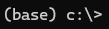
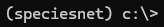

# Setting up a Python environment

This page provides instructions for setting up a Python virtual environment.  If you are already familiar with Python virtual environments, you likely won't find this page very interesting.

There are two steps we recommend before you install SpeciesNet:

1. Install Miniforge (i.e., install Python stuff)
2. Create a Python virtual environment to run SpeciesNet

## Install Miniforge

If you are installing Python for the first time, we recommend installing [Miniforge](https://github.com/conda-forge/miniforge).  Miniforge is an environment for installing and running Python stuff.

### Install Miniforge on Windows

To install Miniforge on Windows, just download and run the [Miniforge installer](https://github.com/conda-forge/miniforge/releases/latest/download/Miniforge3-Windows-x86_64.exe).  If you get a "Windows protected your PC" warning, you might have to click "More info" and "run anyway". You can leave everything at the default value during installation.

All the instructions we provide in the [SpeciesNet README](README.md) will assume you are running at the Miniforge command prompt, which is basically just like a regular command prompt, but it has access to all the Python stuff.  On Windows, once you've installed Miniforge, you can start your Miniforge command prompt by launching the shortcut called "Miniforge prompt".

You will know you are at a Miniforge prompt (as opposed to run-of-the-mill command prompt) if you see an environment name in parentheses before your current directory, like this:

### Install Miniforge on Linux/Mac

The [list of Miniforge installers](https://github.com/conda-forge/miniforge?tab=readme-ov-file#miniforge3) has links for Linux and OSX.  If you're installing on a Mac, be sure to download the right installer: "x86_64" if you are on an Intel Mac, "arm64 (Apple Silicon)" if you are on an M1/M2 Mac with Apple silicon.  In all of these cases, you will be downloading a .sh file; after you run it to install Miniforge, you should see an environment name in parentheses just like in the images above.

## Create a Python virtual environment

Once you've installed Miniforge, open the Miniforge command prompt.  If you are using Windows, you will likely do this using the shortcut called "Miniforge prompt".  If you are on Linux/Mac, you can just start a regular terminal; once you've installed Miniforge, all command prompts are Miniforge command prompts.

As per above, you should see something like this:

We recommend creating a dedicated virtual environment for speciesnet stuff; this is a typical best practice to make sure that Python tools don't get in each other's way.  You can create an environment called "speciesnet" like this:

`conda create -n speciesnet python=3.11 pip -y`

Then whenever you want to use that environment, run:

`conda activate speciesnet`

After that, you should see a prompt that looks like this:

You will need to run the "conda activate" command each time you want to use that environment.

If you see a prompt like the one in the image above, head back to our [SpeciesNet README](README.md) to learn how to run SpeciesNet!
